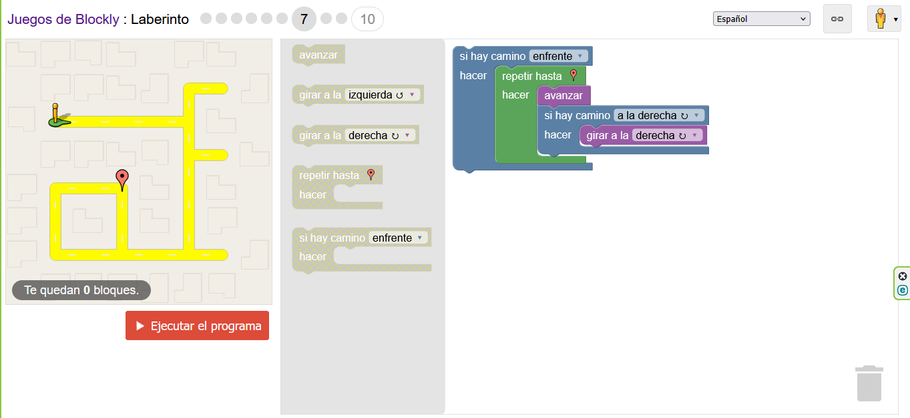
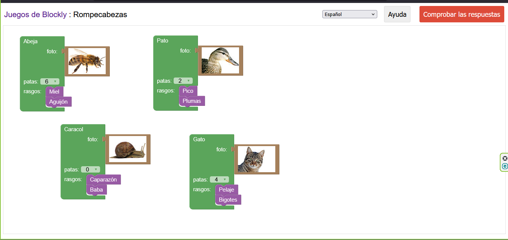

# 🧩 Programación por Bloques - Ejemplos y Análisis

La **programación [1] por bloques** es una metodología visual que facilita la comprensión de la lógica algorítmica mediante el uso de piezas encajables que representan instrucciones. A continuación se muestran ejemplos extraídos de ejercicios educativos (Blockly) y un análisis de cada caso.

---

## 1) Laberinto (Ejemplo visual)

**Descripción:** En este ejercicio el objetivo es guiar un agente a través de un laberinto hasta un punto objetivo empleando bloques de control de flujo como *repetir hasta*, *si hay camino*, *girar* y *avanzar*.

**Análisis:**

- Se aprecia una estrategia basada en la comprobación del camino antes de avanzar.
- El uso de repetición permite iterar hasta llegar al objetivo sin conocer de antemano la cantidad de pasos.

**Imagen del ejemplo:**

---

## 2) Rompecabezas / Asociación (Ejemplo visual)

**Descripción:** Actividad de emparejamiento donde se colocan bloques con propiedades (número de patas, rasgos) para identificar correctamente cada animal. Es ideal para introducir variables [4] y atributos en un contexto visual.

**Análisis:**

- Fomenta la representación de datos [5] (atributos) y la relación entre ellos.
- Enseña cómo modelar información antes de su manipulación programática.

**Imagen del ejemplo:**

---

## Cómo integrar estos ejercicios en el aprendizaje

1. **Del bloque al pseudocódigo:** Explicar el flujo del bloque y traducirlo a pseudocódigo paso a paso.
2. **Validación:** Realizar pruebas de escritorio (simular), identificar casos límite y corregir errores lógicos.
3. **Traspaso a lenguaje textual:** Tomar el algoritmo [2] depurado y convertirlo a C o Python manteniendo la lógica base.

---

 

